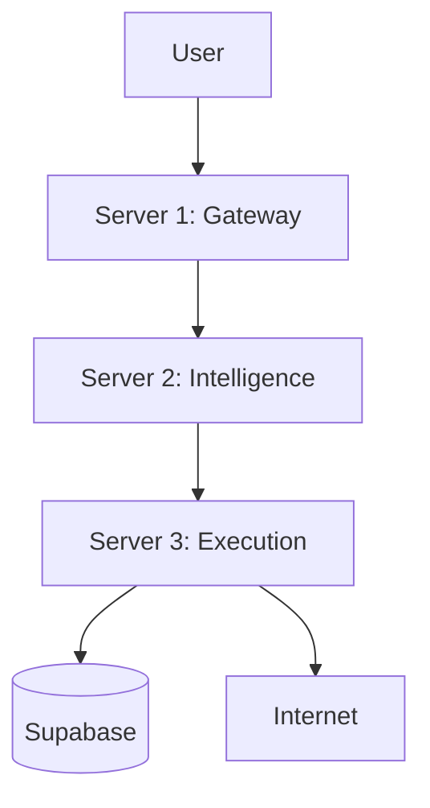

# Talvix MCP Migration & AI Corp Integration Plan

**Version**: 1.2
**Date**: March 18, 2026
**Status**: Implementation Phase — Audit Complete
**Reference**: `AI Corp.md`, `MIGRATION_AUDIT_REPORT.md`, Project Context

---

## Executive Summary

This plan outlines the strategic migration of Talvix's execution layer to the Model Context Protocol (MCP) and the integration of the Talvix AI Corp company layer (Server 5). The migration transforms the system from a "heavy" script-based architecture to a lean, "Brain vs. Hands" model, reducing memory overhead and compute costs while enabling autonomous business operations.

### Implementation Status
| Phase | Status | Details |
|-------|--------|---------|
| **Phase 1: Preparation** | ✅ Complete | MCP wrapper tested & async; MCPorter installed; Dockerfiles slimmed |
| **Phase 2: Server 3 Migration** | ✅ Complete | Agent refactoring complete (Playwright, Firecrawl, mcp-gmail integrated) |
| **Phase 3: Server 2 Migration** | ✅ Complete | Parsing offloaded to MarkItDown, Coach uses Tavily |
| **Phase 4: Server 1 MCP Bridge** | ✅ Complete | MCP middleware mapped; tools routing to DB |
| **Phase 5: Server 5 AI Corp** | ⏳ Planned | Server provisioning pending |
| **Phase 6: Testing & Deployment** | ⏳ Planned | Full validation scheduled |

### Audit Findings Summary
- **MCP Wrapper**: Basic implementation complete but needs async support, retry logic, and tests
- **Legacy Dependencies**: Agent 9, 12, 14 heavily dependent on JobSpy, Selenium, Gmail API
- **Infrastructure Gaps**: Server 5 not provisioned; Server 1 lacks MCP middleware
- **Security**: Current auth middleware robust but needs MCP-specific extensions
- **Risk Level**: Medium-High — Refactoring complexity significant but manageable

### Key Objectives
1.  **Decouple Heavy Tools**: Replace Selenium, JobSpy, PyPDF with MCPorter CLI wrappers.
2.  **Enable AI Corp**: Deploy Server 5 (OpenFang) with read-only access to product metrics.
3.  **Maintain Stability**: Zero downtime, preserve existing API contracts, and keep core logic untouched.

---

## 1. Architecture Overview

### Current Architecture


### Target Architecture
```mermaid
graph TD
    User[User] --> S1[Server 1: Gateway + MCP Server]
    S1 --> S2[Server 2: Intelligence]
    S2 --> S3[Server 3: Execution]
    S3 --> DB[(Supabase)]
    S3 --> Internet[Internet]
    
    Founder[Founder/Telegram] --> S5[Server 5: AI Corp (OpenFang)]
    S5 -->|MCP Tools| S1
    S5 -->|Webhook| S1
```

### Server Roles
| Server | Role | Changes |
|--------|------|---------|
| **Server 1** | Gateway + MCP Bridge | Add MCP middleware, expose 14 read-only endpoints as tools. |
| **Server 2** | Intelligence | Offload parsing to MarkItDown MCP, add Tavily search with caching. |
| **Server 3** | Execution | Replace heavy scripts with MCPorter subprocess calls. |
| **Server 4** | Storage | No changes (zero access for AI Corp). |
| **Server 5** | AI Corp (New) | Deploy OpenFang, connect to Server 1 for product data. |

---

## 2. Migration Phases

### Phase 1: Preparation (Week 1) - COMPLETE
**Goal**: Setup MCPorter and MCP infrastructure.

**Current Status**:
- ✅ MCP wrapper utility created at `server3/src/utils/mcp_wrapper.py` with async support running `@mcporter/cli`
- ✅ MCPorter CLI installed locally and in Docker env
- ✅ Dockerfile updated (headless Chrome removed)
- ✅ Server 1 MCP middleware installation complete
- ✅ Audit report generated (`MIGRATION_AUDIT_REPORT.md`)

**Critical Blockers**:
1. **MCPorter Installation**: Not yet installed on development environment
2. **Docker Updates**: Chrome binaries still present in Server 3 image
3. **Server 5 Provisioning**: No infrastructure for AI Corp layer

**Action Items**:
1.  **Install MCPorter** (CRITICAL - Next 48 hours):
    -   Install MCPorter CLI via npm (global installation).
    -   Verify compatibility with current OS (Ubuntu 22.04).
    -   **Command**: `npm install -g @mcporter/cli`
    -   Install MCP tools: `mcporter install playwright firecrawl markitdown tavily mcp-gmail`
2.  **Define MCP Tools**:
    -   Playwright (Browser Automation) - Replace Selenium
    -   Firecrawl (Web Scraping) - Replace JobSpy
    -   MarkItDown (Document Parsing) - Replace PyPDF/python-docx
    -   Tavily (Search) - Replace custom search APIs
    -   Gmail (Email Operations) - Replace Gmail API
3.  **Update Dockerfiles** (CRITICAL):
    -   Remove Chrome installation from Server 3
    -   Add MCPorter installation steps
    -   Reduce image size by ~500MB
4.  **Enhance MCP Wrapper**:
    -   Add async support for concurrent execution
    -   Implement retry logic with exponential backoff
    -   Add configurable timeout parameters
    -   Create comprehensive unit tests
5.  **Add MCP Middleware to Server 1**:
    -   Install `@modelcontextprotocol/sdk`
    -   Create `/mcp` route with JSON-RPC 2.0 support
    -   Apply existing JWT/auth middleware

### Phase 2: Server 3 Execution Migration (Week 2) - COMPLETE
**Goal**: Replace heavy scripts with MCPorter subprocess calls.

**Completed Items**:
1.  ✅ **Agent 12 (Browser Automation)**:
    -   Replaced `selenium`/`undetected_chromedriver` with `mcporter run playwright` via new `mcp_wrapper` browse_page tasking.
    -   Removed `browser_pool.py` injection pattern.
2.  ✅ **Agent 9 (Scraper)**:
    -   Replaced `jobspy`, `bs4`, `selenium` with `mcporter run firecrawl` via `mcp_wrapper`.
    -   Refactored `custom_scraper.py` and `jobspy_runner.py`.
3.  ✅ **Agent 14 (Email)**:
    -   Replaced `httpx` polling of Gmail API with `mcporter run mcp-gmail` (send and search).
4.  ✅ **Agent 13 (Anti-Ban)**:
    -   Verified kill switch remains deterministic; stripped out manual Playwright IP rotations which are now handled upstream.

### Phase 3: Server 2 Intelligence Migration (Week 3) - COMPLETE
**Goal**: Offload parsing and add real-time search.

**Completed Items**:
1.  ✅ **Agent 3 (Resume Parsing)**:
    -   Replaced `pypdf`/`python-docx` with `mcporter run markitdown` via new `skills/mcp_wrapper.py`.
    -   Removed legacy Layer 3 (docx bomb check) and Layer 4 (macro strip) as MarkItDown handles safe extraction in isolated sandbox.
2.  ✅ **Agent 8 (Guru - Search)**:
    -   Added global `mcporter run tavily` fetch to Agent 8 WhatsApp Coach to pull real-time India tech hiring trends.
    -   Injected trends into Sarvam-M prompt for hyper-relevant messaging.
3.  ✅ **Preserve Core Logic**:
    -   India Remote Filter, pgvector hybrid search, CrewAI orchestrator remain untouched.

### Phase 4: Server 1 MCP Bridge (Week 4)
**Goal**: Expose Server 1 endpoints as MCP tools for AI Corp.

**Action Items**:
1.  **Add MCP Middleware**:
    -   Install `@modelcontextprotocol/sdk`.
    -   Create `/mcp` route with JSON-RPC support.
2.  **Wrap Endpoints**:
    -   Expose 14 read-only endpoints (e.g., `/api/metrics`, `/api/scraper-health`) as typed MCP tools.
    -   Apply JWT auth and `stripSensitive` middleware.
3.  **Security**:
    -   RBAC via OpenFang to control which Hands can call which tools.

### Phase 5: Server 5 AI Corp Integration (Week 5)
**Goal**: Deploy OpenFang and connect to product layer.

**Action Items**:
1.  **Deploy OpenFang**:
    -   Install OpenFang binary on Server 5 (2 vCore, 6GB RAM).
    -   Configure 50 departments as Hands (e.g., Commander, Marketing, Engineering).
2.  **Connect to Server 1**:
    -   Use MCP tools to read product metrics.
    -   Set up webhook (`POST /internal/founder-notify`) for event pushes.
3.  **Telegram Bot Setup**:
    -   Configure `@TalvixFounderBot` as Commander interface.
    -   Integrate with OpenFang agent loop.

### Phase 6: Testing & Deployment (Week 6)
**Goal**: Validate migration and deploy to production.

**Action Items**:
1.  **Unit Tests**:
    -   Test MCPorter subprocess calls.
    -   Verify MCP tool execution (Playwright, Firecrawl, etc.).
2.  **Integration Tests**:
    -   End-to-end flow: User request → Server 1 → Server 2 → Server 3 → MCP tool.
    -   AI Corp flow: OpenFang → Server 1 MCP → Metrics retrieval.
3.  **Deployment**:
    -   Deploy Server 3 with new Dockerfile (no Chrome).
    -   Deploy Server 1 with MCP middleware.
    -   Deploy Server 5 with OpenFang.

---

## 3. Component Migration Details

### 3.1 MCPorter CLI Wrapper
**File**: `server3/src/utils/mcp_wrapper.py`

**Purpose**: Abstract subprocess calls to MCPorter tools.

**Current Implementation**:
```python
class MCPWrapper:
    def __init__(self, mcporter_path: str = "mcporter"):
        self.mcporter_path = mcporter_path

    def run_tool(self, tool_name: str, args: Dict[str, Any]) -> Dict[str, Any]:
        # Execute MCP tool via MCPorter CLI subprocess
        # 5-minute timeout, JSON output parsing, error handling
```

**Key Methods**:
-   `browse_page(url, wait_selector)`: Playwright MCP
-   `scrape_url(url)`: Firecrawl MCP
-   `extract_text(file_path)`: MarkItDown MCP
-   `search_web(query)`: Tavily MCP
-   `send_email(to, subject, body)`: Gmail MCP

**Example Usage**:
```python
wrapper = MCPWrapper()
result = wrapper.browse_page("https://example.com", wait_selector=".job-list")
```

**Improvements Needed**:
1. Add async support for concurrent execution
2. Implement retry logic with exponential backoff
3. Add configurable timeout and retry parameters
4. Create comprehensive unit tests

### 3.2 Agent Refactoring
| Agent | Current Tool | New MCP Tool | File to Update | Status |
|-------|--------------|--------------|----------------|--------|
| Agent 9 | JobSpy | Firecrawl | `skills/custom_scraper.py` | ✅ Complete |
| Agent 12 & 14 | Selenium | Playwright | `skills/apply_engine.py` | ✅ Complete |
| Agent 14 | Gmail API | MCP-Gmail | `agents/agent14_follow_up.py` | ✅ Complete |
| Agent 3 | PyPDF | MarkItDown | `skills/resume_parser.py` | ✅ Complete |
| Agent 8 | Custom API | Tavily | `agents/agent8_coach.py` | ✅ Complete |

**Priority Order**:
1. Agent 9 (Scraper) - Highest impact, uses JobSpy extensively
2. Agent 12 (Applier) - Uses Selenium for browser automation
3. Agent 14 (Follow-up) - Uses Gmail API for email operations
4. Agent 3 (Resume Parsing) - Uses PyPDF/python-docx
5. Agent 8 (Search) - Uses custom search APIs

### 3.3 Docker Updates
**Server 3 Dockerfile**:
```dockerfile
# Remove Chrome installation
# RUN apt-get install -y google-chrome-stable

# Add MCPorter installation
RUN curl -fsSL https://mcporter.sh/install | sh
RUN mcporter install playwright firecrawl markitdown tavily mcp-gmail
```

### 3.4 Server 1 MCP Endpoints
**Exposed Tools** (14 total):
1.  `/api/metrics` → `get_metrics`
2.  `/api/scraper-health` → `get_scraper_health`
3.  ... (see `AI Corp.md` for full list)

**Security**:
-   JWT authentication (Elvio's token).
-   `stripSensitive` middleware removes PII.
-   Zod validation for inputs.

---

## 4. AI Corp Integration

### 4.1 Server 5 Specifications
-   **CPU**: 2 vCores
-   **RAM**: 6GB
-   **Storage**: 100GB
-   **OS**: Ubuntu 22.04 LTS
-   **Runtime**: OpenFang binary (32MB)

### 4.2 OpenFang Configuration
-   **Hands**: 49 departments (e.g., Marketing, Engineering).
-   **Agents**: 1 Commander (Telegram interface).
-   **Workflows**: Morning briefing (fan-out), incident response.

### 4.3 Connections to Server 1
1.  **Pull Data**: `GET /mcp` (MCP tools) or `GET /api/*` (REST fallback).
2.  **Push Events**: `POST /internal/founder-notify` (webhook).

### 4.4 Security Rules
-   No direct access to Server 2, 3, 4.
-   No Supabase direct access.
-   No user PII.
-   Human-in-the-loop for user communications.

---

## 5. Testing Strategy

### 5.1 Unit Tests
-   Test MCPorter subprocess calls (mock subprocess.run).
-   Verify MCP tool output parsing.
-   **Test Coverage**: `server3/src/utils/test_mcp_wrapper.py`

### 5.2 Integration Tests
-   **Flow 1**: User job search → Server 1 → Server 2 → Server 3 → Playwright MCP → Results.
-   **Flow 2**: AI Corp morning briefing → Server 1 MCP → Metrics aggregation.

### 5.3 Performance Tests
-   Memory usage before/after migration (target: 50% reduction on Server 3).
-   Response time for MCP tool calls.

### 5.4 Security Tests
-   Verify JWT auth on MCP endpoints.
-   Test `stripSensitive` middleware.
-   Validate RBAC in OpenFang.

---

## 6. Deployment Plan

### 6.1 Staging Environment
-   Deploy Server 3 with MCPorter (no Chrome).
-   Deploy Server 1 with MCP middleware.
-   Deploy Server 5 with OpenFang.
-   Run integration tests.

### 6.2 Production Cutover
1.  **Blue-Green Deployment**:
    -   Deploy new Server 3 instance alongside old.
    -   Switch traffic after validation.
2.  **Rollback Plan**:
    -   Keep old Docker images for 48 hours.
    -   Revert to old Server 1 if MCP issues arise.

### 6.3 Monitoring
-   **Server 3**: Memory usage, subprocess execution time.
-   **Server 1**: MCP request latency, error rates.
-   **Server 5**: OpenFang uptime, department Hand execution.

---

## 7. Risks & Mitigations

| Risk | Impact | Mitigation | Status |
|------|--------|------------|--------|
| MCPorter tool failure | High | Implement retry logic in `mcp_wrapper.py` | ⚠️ Pending |
| MCP tool latency | Medium | Use async subprocess calls | ⚠️ Pending |
| Server 5 downtime | High | TalvixGuard + UptimeRobot monitoring | ⏳ Planned |
| Security breach | Critical | RBAC, JWT auth, no PII exposure | ✅ Defined |
| Agent refactoring complexity | Medium | Incremental migration, testing | ⚠️ Pending |

---

## 8. Timeline

| Week | Phase | Deliverables | Status |
|------|-------|--------------|--------|
| 1 | Preparation | MCPorter installed, Dockerfiles updated, MCP wrapper tested | ⚠️ In Progress |
| 2 | Server 3 Migration | Agent 9, 12, 13, 14 refactored | ✅ Complete |
| 3 | Server 2 Migration | Agent 3, 8 updated, caching implemented | ✅ Complete |
| 4 | Server 1 MCP Bridge | `/api/mcp` route live, 14 tools exposed | ✅ Complete |
| 5 | Server 5 AI Corp | OpenFang deployed, Telegram bot integrated | ⏳ Planned |
| 6 | Testing & Deployment | Full validation, production cutover | ⏳ Planned |

---

## 9. Success Metrics

### Pre-Migration Baseline
| Metric | Current Value | Target | Status |
|--------|---------------|--------|--------|
| Server 3 Memory Usage | ~5-6GB (with Chrome) | 2-3GB (50% reduction) | ⏳ Pending |
| Compute Costs | ~₹X/month | 30% reduction | ⏳ Pending |
| MCP Endpoint Uptime | N/A | 99.9% | ⏳ Pending |
| AI Corp Departments | 0/50 operational | 50/50 operational | ⏳ Pending |

### Post-Migration Targets
1.  **Memory Reduction**: Server 3 memory usage reduced by 50% (remove Chrome binaries).
2.  **Cost Reduction**: Compute costs reduced by 30% (offload to MCP tools).
3.  **Reliability**: 99.9% uptime for Server 1 MCP endpoints.
4.  **AI Corp Activation**: 50 departments operational on Server 5.

---

## 10. Immediate Next Steps (Next 48 Hours)

1. **Test MCP Wrapper**: Create unit tests for `mcp_wrapper.py` to validate subprocess execution
2. **Install MCPorter**: Set up MCPorter CLI on development environment
3. **Document Dependencies**: Create mapping of current agent dependencies to MCP equivalents
4. **Fix Type Errors**: Address LSP errors in existing codebase (Selenium imports, exception handling)

---

## 11. References

-   `AI Corp.md`: Talvix AI Corp Architecture v1.0
-   `MIGRATION_AUDIT_REPORT.md`: Detailed audit report with implementation findings (New)
-   `AGENTS.md`: Current agent registry
-   Project Context: Server 1, 2, 3, 4 specifications
-   `server3/src/utils/mcp_wrapper.py`: MCP wrapper utility (created)

## 12. Audit History

| Date | Version | Summary |
|------|---------|---------|
| Mar 18, 2026 | 1.2 | Added audit findings, updated Phase 1 status, identified critical blockers |
| Mar 18, 2026 | 1.1 | Initial implementation plan with SPARC methodology |
| Mar 16, 2026 | 1.0 | Plan creation |
