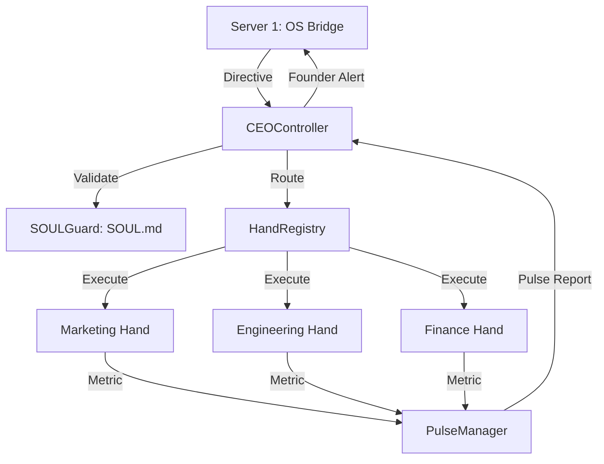

# [A] Architecture: Dept 1 — Commander (CEO-OS)
**Task ID:** `dept1-ceo-os-architecture`
**Derived From:** `dept1-ceo-os-plan.md`

## 1. System Components

The CEO-OS is a **Hierarchical Meta-Controller** that bridges the external API (OS Bridge) with internal department "Hands".

- **CEOController (`ceo_agent.py`)**: The main Python class responsible for directive processing and event orchestration.
- **HandRegistry**: A registry of all 50 departments and their associated TOML command sets.
- **SOULGuard**: A static analysis tool that matches every command against the constraints in `SOUL.md`.
- **PulseManager**: An async background worker that aggregates health metrics from all active Hands.

---

## 2. Component Diagram (Mermaid)


---

## 3. Data Structure: `HandDefinition`
Each department (1-50) is defined as a `Hand` object:
```python
class HandDefinition:
    dept_id: int
    name: str
    config_path: str  # Path to the .toml Skill set
    status: str       # ACTIVE, IDLE, FAILED
    last_action: str  # Description of last task
```

---

## 4. API Specification (Internal Bridge)

### `POST /api/ceo/directive`
| Field | Type | Description |
| :--- | :--- | :--- |
| `dept_id` | Int | Target department for the action. |
| `task` | String | Description of the action to perform. |
| `priority` | String | LOW, MEDIUM, HIGH, CRITICAL. |
| `params` | Dict | Optional parameters for the Hand's skill. |

---

## 5. Security & Isolation
- **Process Isolation**: Every Hand execution should run in its own async process to prevent a crash in one department from taking down the CEO-OS.
- **Directive Signing**: All incoming directives from Server 1 must include a valid `AGENT_SECRET` header.
- **Warp-Speed Fallback**: If the PulseManager detects a `FAILED` status in more than 3 critical departments, the CEO-OS triggers a `LOCKDOWN` mode, notifying the Founder immediately.
